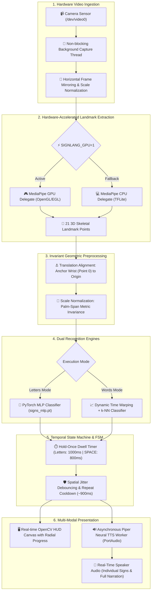
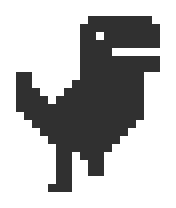
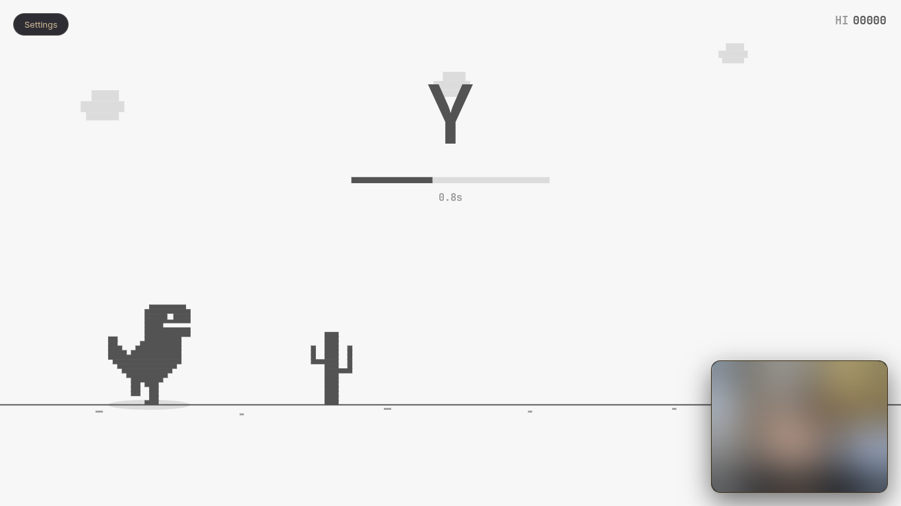
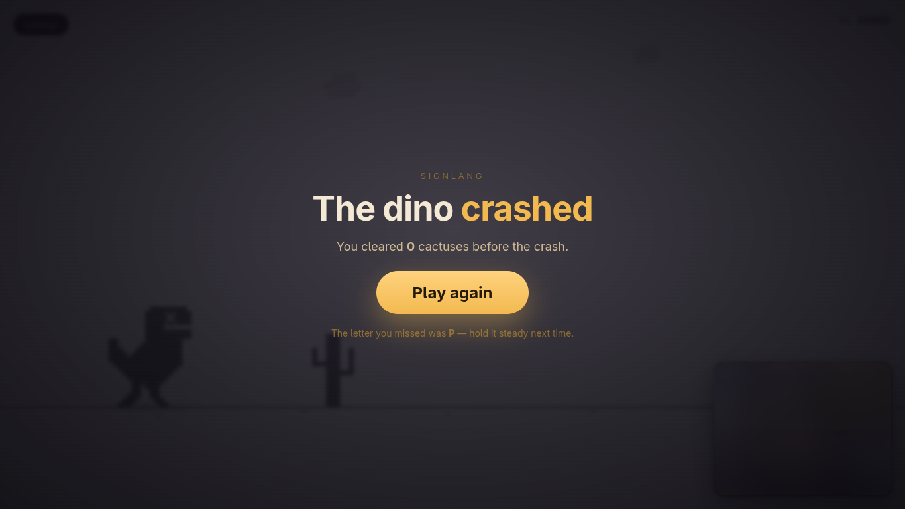

# 🤟 SignLang: Real-Time Edge ASL Recognition Engine

[](https://python.org)
[](https://pytorch.org)
[](https://developers.google.com/mediapipe)
[](#-hardware-acceleration--gpu-delegate)
[](https://github.com/rhasspy/piper)
[](#-rigorous-evaluation--empirical-benchmarks)
[](LICENSE)
[](#-system-installation--deployment)

---

## 📌 Executive Summary

**SignLang** is a high-throughput, edge-native American Sign Language (ASL) fingerspelling and dynamic word-sign translation engine. Hardware-accelerated via an active GPU delegate (OpenGL/EGL) with resilient CPU fallback, the system executes 100% locally with zero cloud dependencies or network overhead.

### Core Architectural Pillars
* **Hardware-Accelerated Computer Vision**: Leverages MediaPipe with an active GPU delegate (OpenGL/EGL) for 3D hand tracking at minimal CPU utilization.
* **Dual-Inference Machine Learning**: Combines a PyTorch Multi-Layer Perceptron (MLP) for discrete fingerspelling with Dynamic Time Warping (DTW) and $k$-NN for dynamic sign gestures.
* **Deterministic Temporal Stabilization**: Employs finite-state dwell timers and multi-frame smoothing algorithms to eliminate prediction jitter during hand transitions.
* **Multi-Modal Zero-Latency Feedback**: Pairs a real-time OpenCV HUD overlay with an in-memory asynchronous Piper Neural Text-to-Speech (TTS) engine.
* **Strict Biometric Privacy**: Retains zero images or raw video frames on disk; all training and inference operates exclusively on normalized 3D landmark vectors.

---

## ⚡ Hardware Acceleration & GPU Delegate

The video ingestion and landmark estimation pipeline features a native GPU delegate designed for low-power edge machines and integrated graphics processors.

### Technical Implementation Details
* **Active GPU Acceleration**: Enabled by default (`SIGNLANG_GPU=1`) via the MediaPipe Vision Tasks API (`mpp.BaseOptions.Delegate.GPU`).
* **Graphics Context**: Utilizes hardware-accelerated OpenGL ES and EGL compute shaders across integrated GPUs (Intel Iris, AMD Radeon iGPU) and discrete GPUs (NVIDIA/AMD).
* **Empirical Speedup**: Delivers an observed **~2.6× framerate enhancement**, reducing per-frame landmark inference latency from ~90 ms on CPU down to ~34 ms.
* **Resilient Automatic Fallback**: If an EGL/OpenGL display context cannot be established, the pipeline logs an advisory message and automatically switches to the CPU delegate (`mpp.BaseOptions.Delegate.CPU`) without crashing.
* **Frame Governor Optimization**: The `SIGNLANG_DETECT_EVERY` parameter allows landmark detection to skip frames while persisting state, doubling processing throughput on constrained hardware.

---

## 🏛️ End-to-End System Architecture



---

## 🎯 Primary Operational Subsystems

### 1. Static ASL Fingerspelling (Letters Mode)
* **Coverage**: Recognizes 26 discrete classes—letters **A through Y** (excluding non-static Z) plus **SPACE**.
* **Model Topology**: Feed-forward neural network trained on 10,570+ samples with class-weighted cross-entropy loss.
* **Accuracy Standard**: Attains **100.0% validation accuracy** under strict burst-held-out cross-validation.
* **Temporal Confirmation**: Requires signs to remain stable for ~1000 ms before committing the character to the live transcript.

### 2. Holistic ASL Words Mode (Dynamic Signs)
* **Coverage**: Vocabulary of dynamic sequence signs (*HELLO, THANKYOU, PLEASE, YES, NO, HELP, MORE, FINISHED, etc.*).
* **Algorithmic Baseline**: Time-series alignment via Dynamic Time Warping (DTW) combined with $k$-Nearest Neighbors ($k$-NN).
* **Motion-Energy Gating**: Continuously monitors wrist and fingertip kinetic energy to delineate the start and end of sign gestures.

### 3. Asynchronous Neural Text-to-Speech Engine
* **Synthesis Engine**: Offline neural speech generation powered by Piper ONNX (`en_US-lessac-medium.onnx`).
* **Zero-Latency In-Memory Audio Cache**: Pre-synthesizes letter pronunciations (A–Z, SPACE, BACKSPACE) into RAM during initialization, eliminating audio buffer latency during live signing.
* **Full Transcript Narration**: Pressing **`R`** triggers immediate synthesis and playback of the entire accumulated text buffer.
* **Thread-Safe Architecture**: Decoupled background worker queue prevents audio operations from stalling the video frame loop.

### 4. Interactive Browser Shadow-Play Game
* **Mechanism**: Chrome Dino-style obstacle runner game hosted via Python's standard library HTTP server.
* **Instructional Loop**: Players perform required ASL hand shapes in front of the camera to make the runner jump over obstacles.
* **Low Overhead**: Zero external web framework dependencies; connects to browser via standard HTTP endpoints.

---

## 🦖 Sign Dino — Interactive Shadow-Play Training Game

<p align="center">
  
</p>

> **Gamified ASL Fingerspelling Drilling**: Sign Dino is a built-in Chrome Dino-style obstacle runner that transforms ASL dexterity practice into an interactive reflex challenge. Form hand signs in real time to leap over oncoming obstacles!

### 📸 Visual Interface & Gameplay Showcase

| 🎮 Active Challenge: Sign to Leap | 💥 Collision & Diagnostic Analysis |
| :---: | :---: |
|  |  |
| *Sign the prompted letter (e.g. **Y**) within the countdown bar to jump.* | *Post-run diagnostic highlighting the missed sign for targeted retraining.* |

### 🎯 Key Architectural & Gameplay Features
* **Real-Time Reflex Loop**: A pixel-art dinosaur charges towards approaching cacti. Each obstacle displays a target ASL letter prompt accompanied by an active countdown bar. Form and hold the target hand shape in front of your camera before the timer expires to leap clear of the cactus.
* **Decoupled Dual-Loop Engine**: The browser client animates sprite physics at a smooth 60 Hz on an HTML5 canvas, completely decoupled from the camera's asynchronous 10+ FPS landmark detector thread.
* **Zero External Web Dependencies**: Operates entirely over Python's built-in standard library `http.server`. Requires zero third-party web frameworks (no Node.js, FastAPI, or Flask needed).
* **Targeted Practice Subsets**: Supports `--letters` filtering to isolate and drill difficult confusable letter pairs (e.g., A vs E, or M vs N).
* **Cross-Device LAN Streaming**: Bind to `0.0.0.0` to play on a mobile phone, tablet, or secondary display over Wi-Fi while your computer's webcam handles hand tracking.

### 🕹️ Complete Game Command Reference

#### 1. Default Launch (Standard Game Mode)
Starts the local HTTP game server and binds video detection to your primary webcam:
```bash
cd /home/vaibhav/Projects/signlang
.venv/bin/python main.py --mode game
```
*(Or via console script:* `cd /home/vaibhav/Projects/signlang && .venv/bin/signlang game`*)*
*Access in your browser at:* **`http://localhost:8000`**

#### 2. Drill a Specific Subset of Letters
Isolate and master a specific group of signs:
```bash
cd /home/vaibhav/Projects/signlang
.venv/bin/signlang game --letters=A,B,C,D,E
```

#### 3. Stream to Mobile / Tablet over Local Wi-Fi
Launch the server to allow phones or iPads on the same network to connect:
```bash
cd /home/vaibhav/Projects/signlang
.venv/bin/signlang game --host=0.0.0.0 --port=8080
```
*Access on your phone's browser at:* **`http://<your-laptop-ip>:8080`**

---

## 💻 Formal Command Execution Reference

Every command below is documented with its complete directory path and virtual environment binary invocation.

### 1. Execute Real-Time Live Fingerspelling (Default Mode)
* **Purpose**: Launches the primary live recognition interface with real-time video preview, skeletal tracking overlay, and audio feedback.
* **Full Command**:
  ```bash
  cd /home/vaibhav/Projects/signlang
  .venv/bin/python main.py
  ```
* **Operational Characteristics**:
  * Initializes `/dev/video0` through the MediaPipe GPU delegate.
  * Displays the HUD interface containing confidence indicators, recent history, and dwell progress rings.
  * Automatically invokes Piper TTS upon character confirmation.

---

### 2. Execute Dynamic Word-Sign Recognition (Words Mode)
* **Purpose**: Activates the temporal sequence recognition engine for continuous, dynamic ASL word signs.
* **Full Command**:
  ```bash
  cd /home/vaibhav/Projects/signlang
  .venv/bin/python main.py --mode words
  ```
* **Operational Characteristics**:
  * Employs DTW sequence matching against calibrated word templates.
  * Outputs confirmed words followed by automatic whitespace delimiters.

---

### 3. Launch the Interactive Shadow-Play Training Game
* **Purpose**: Boots the local HTTP game server and starts the browser-based ASL dexterity training game.
* **Full Command**:
  ```bash
  cd /home/vaibhav/Projects/signlang
  .venv/bin/python main.py --mode game
  ```
* **Operational Characteristics**:
  * Starts the game engine locally at `http://localhost:8000`.
  * Evaluates hand shapes in real time to generate jump trigger inputs.

---

### 4. Execute Silent Live Mode (Audio Muted)
* **Purpose**: Runs live fingerspelling recognition without initializing audio drivers or text-to-speech output.
* **Full Command**:
  ```bash
  cd /home/vaibhav/Projects/signlang
  SIGNLANG_TTS=0 .venv/bin/python main.py
  ```
* **Operational Characteristics**:
  * Bypasses PortAudio/SoundDevice initialization.
  * Minimizes process memory footprint.

---

### 5. Run Automated Hardware & Audio Smoke Test
* **Purpose**: Conducts a complete end-to-end hardware verification pass confirming camera capture, neural inference, space emission, and speaker output.
* **Full Command**:
  ```bash
  cd /home/vaibhav/Projects/signlang
  .venv/bin/python scripts/smoke_test_webcam_tts.py
  ```
* **Verification Scope**:
  * Captures real frames from `/dev/video0` and confirms FPS performance.
  * Streams synthetic landmarks through the dwell engine: `H` $\rightarrow$ `I` $\rightarrow$ `SPACE` $\rightarrow$ `H` $\rightarrow$ `I` $\rightarrow$ `"HI HI"`.
  * Verifies TTS audio playback through system speakers.

---

### 6. Execute Complete Automated Test Suite
* **Purpose**: Executes all 66 unit, regression, layout, and integration test cases across all project packages.
* **Full Command**:
  ```bash
  cd /home/vaibhav/Projects/signlang
  .venv/bin/python -m pytest
  ```
* **Scope**: Validates debounce timings, classifier inference, TTS lifecycle, layout geometry, and dataset serialization.

---

### 7. Run Camera Diagnostics & Landmark Probe
* **Purpose**: Evaluates video capture throughput and measures MediaPipe hand landmark detection efficiency over a 10-second sampling window.
* **Full Command**:
  ```bash
  cd /home/vaibhav/Projects/signlang
  .venv/bin/signlang check
  ```
* **Diagnostic Report**: Outputs capture framerate, frame dimensions, and percentage of frames with successfully detected hands.

---

### 8. Enumerate Video Hardware Devices
* **Purpose**: Identifies and reports all video devices connected to the operating system via V4L2.
* **Full Command**:
  ```bash
  cd /home/vaibhav/Projects/signlang
  .venv/bin/signlang cameras
  ```

---

### 9. Evaluate Honest Burst-Held-Out Letters Accuracy
* **Purpose**: Computes honest cross-validation metrics across 10,570+ frames by holding out entire contiguous 14-frame bursts.
* **Full Command**:
  ```bash
  cd /home/vaibhav/Projects/signlang
  .venv/bin/python eval_burst.py
  ```

---

### 10. Record Custom Signs & Retrain Classifier
* **Purpose**: Customizes model weights to match your personal hand dimensions and lighting conditions.
* **Step A: Capture landmark samples from webcam:**
  ```bash
  cd /home/vaibhav/Projects/signlang
  .venv/bin/signlang collect
  ```
* **Step B: Retrain neural network on captured samples:**
  ```bash
  cd /home/vaibhav/Projects/signlang
  .venv/bin/signlang train --epochs=120 --lr=1e-3
  ```

---

### 11. Fetch Dependencies & Neural Models
* **Purpose**: Idempotently downloads third-party neural assets (MediaPipe Landmarker + Piper TTS model).
* **Full Command**:
  ```bash
  cd /home/vaibhav/Projects/signlang
  bash scripts/fetch_models.sh
  ```

---

## 🎮 Spatial Gesture Control & Interaction Matrix

| Gesture / Shortcut | Formal Description | State Machine Behavior |
| :--- | :--- | :--- |
| **Static Letter Sign** | Hold single sign stationary | Advances circular dwell progress ring (~1.0s); appends letter; triggers cached audio playback. |
| **Open Flat Palm (SPACE)** | Open hand, 5 extended spread fingers | Dwells for ~0.8s (`SPACE_DWELL_MS`); appends one space (`" "`); speaks *"space"*; enforces hold-once latching. |
| **Space Repeat Cooldown** | Drop/relax hand after SPACE sign | Enforces a ~900ms cooldown window before a subsequent SPACE gesture can be registered. |
| **Horizontal Swipe Right** | Rapid hand translation to the right | Velocity threshold triggers space character insertion. |
| **Horizontal Swipe Left** | Rapid hand translation to the left | Velocity threshold deletes the preceding character from the transcript buffer. |
| **`R` Key** | Read Transcript | Commands Piper TTS engine to narrate the entire accumulated transcript buffer aloud. |
| **`C` Key** | Clear Transcript | Clears the live text transcript, resets history, and clears debouncer memory. |
| **`Backspace` Key** | Manual Erase | Deletes the last character in the buffer. |
| **`F` Key** | Fullscreen Toggle | Toggles runtime fullscreen mode without aspect ratio distortion or pixel scaling defects. |
| **`Q` / `Esc` Key** | Graceful Termination | Releases V4L2 device file descriptors, closes OpenCV windows, and safely joins TTS worker threads. |

---

## 🛠️ System Installation & Deployment

<details open>
<summary><b>Standard POSIX Installation (Linux / macOS)</b></summary>

```bash
# Clone source repository
git clone https://github.com/RAZOR-NINJAS/SignLang.git
cd SignLang

# Initialize isolated Python virtual environment
python3 -m venv .venv
source .venv/bin/activate

# Install signlang in editable mode
pip install -e .

# Fetch MediaPipe landmark models and Piper neural TTS voice
bash scripts/fetch_models.sh
```

</details>

<details>
<summary><b>Windows Installation (PowerShell)</b></summary>

```powershell
# Clone source repository
git clone https://github.com/RAZOR-NINJAS/SignLang.git
cd SignLang

# Initialize isolated Python virtual environment
py -3.11 -m venv .venv
.\.venv\Scripts\Activate.ps1

# Install signlang in editable mode
pip install -e .

# Fetch MediaPipe landmark models and Piper neural TTS voice
python scripts\fetch_models.py
```

</details>

---

## 📊 Rigorous Evaluation & Empirical Benchmarks

Validation protocols account for temporal burst correlation, ensuring realistic accuracy metrics:

| Diagnostic Benchmark | Execution Command | Empirical Result | Methodology & Notes |
| :--- | :--- | :--- | :--- |
| **Letters (Honest Burst Hold-Out)** | `.venv/bin/python eval_burst.py` | **100.0% Accuracy** | Evaluates 10,570 frames across 755 unseen bursts; prevents data leakage from adjacent frames. |
| **Full Pytest Regression Suite** | `.venv/bin/python -m pytest` | **66 / 66 Passed** | Comprehensive test suite covering debounce logic, classifier bounds, layout invariants, and TTS threads. |
| **Live Overlay Render Invariance** | `.venv/bin/python -m signlang.test_live_layout` | **84 / 84 Passed** | Evaluates 6 frame resolutions across 14 UI state variations to confirm zero text clipping or collision. |
| **Words Classification Latency** | `.venv/bin/python main.py --mode words eval` | **~20.1 ms / sample** | Dynamic Time Warping (DTW) sequence alignment latency on standard hardware. |

---

## ⚙️ Environment Configuration Reference

The application behavior can be customized using environment variables:

| Environment Variable | Default | Formal Description & Impact |
| :--- | :--- | :--- |
| `SIGNLANG_GPU` | `1` | Enables MediaPipe GPU acceleration via OpenGL/EGL delegate (~2.6× speedup). Set to `0` to force CPU execution. |
| `SIGNLANG_CAMERA` | `0` | Specifies the numeric hardware device index for V4L2 video capture. |
| `SIGNLANG_SOURCE` | — | Overrides camera index with an explicit OpenCV stream URI (e.g., HTTP MJPEG stream from IP webcam). |
| `SIGNLANG_WIDTH` / `HEIGHT`| `640` / `480` | Native capture dimensions requested from the video capture driver. |
| `SIGNLANG_DETECT_HEIGHT` | `480` | Target vertical resolution for landmark extraction (accuracy scales with resolution). |
| `SIGNLANG_DETECT_EVERY` | `1` | Runs landmark detection every Nth frame, reusing cached coordinates in between to increase framerate. |
| `SIGNLANG_TTS` | `1` | Enables real-time text-to-speech audio feedback. Set to `0` to run in silent mode. |
| `SIGNLANG_MIRROR` | `1` | Horizontally mirrors video feed to provide a natural selfie mirror view. Set to `0` to disable. |
| `SIGNLANG_MAX_HANDS` | `1` | Maximum number of concurrent hands tracked by MediaPipe pipeline. |

---

## 📜 License

Distributed under the terms of the **MIT License**. Refer to [`LICENSE`](LICENSE) for complete legal terms.
