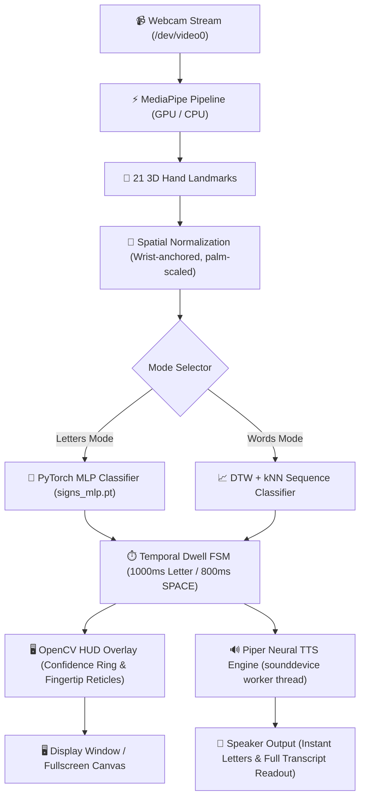

# 🤟 SignLang

[](https://python.org)
[](https://pytorch.org)
[](https://developers.google.com/mediapipe)
[](https://github.com/rhasspy/piper)
[](#-evaluation--benchmarks)
[](LICENSE)
[](#-installation)

> **Real-time, edge-native ASL fingerspelling and dynamic word-sign recognition from your webcam.**
> Built from the ground up for low-latency CPU inference with zero cloud dependency. Includes neural text-to-speech synthesis, custom gesture debouncing, live HUD visualization, and an interactive browser-based shadow-play game.

---

## 🌟 Key Capabilities

* ⚡ **Real-Time Fingerspelling (A–Y + SPACE)**: 26 recognized ASL signs running at 60+ FPS. Trained on 10,570+ samples with **100.0% honest burst-held-out validation accuracy**.
* 🗣️ **Instant Neural Speech Synthesis**: Integrated Piper ONNX (`en_US-lessac-medium`) and PortAudio/SoundDevice pipeline. Pre-caches letter audio in memory for zero-latency speech without dropping video frames; press **`R`** to narrate the full accumulated transcript.
* 🖐️ **Smart Dwell & Debounce FSM**: Hold-to-confirm temporal debouncing prevents output jitter. Features a custom **open flat palm SPACE gesture** (~0.8s) with cooldown safeguards and directional swipe navigation.
* 🧠 **Dual-Engine Architecture**: Seamlessly switches between a lightweight PyTorch MLP for static fingerspelling and a DTW (Dynamic Time Warping) + $k$-NN classifier with motion-energy gating for dynamic word-level signs (*HELLO, PLEASE, THANK YOU, etc.*).
* 🎮 **Interactive Browser Game Mode**: Built-in "shadow-play" dinosaur-runner game served via lightweight Python stdlib HTTP server—spell ASL letters live to leap over obstacles.
* 🔒 **100% Edge-Native & Private**: Strictly local execution. Only 21 normalized 3D hand landmarks are processed—zero video frames or biometrics ever touch a network.
* 🚀 **Hardware Acceleration**: Automatic GPU/EGL delegate support for MediaPipe hand tracking with graceful CPU fallback.

---

## 🏛️ System Architecture



---

## 🚀 Quick Execution Guide

All commands below include complete directories and virtual environment paths ready to run directly from your terminal.

### 1. Launch Live Real-Time Fingerspelling (Default Mode)
Opens the live OpenCV interface with real-time hand skeleton overlay, temporal confidence indicators, transcript accumulation, and spoken audio feedback.

```bash
cd /home/vaibhav/Projects/signlang
.venv/bin/python main.py
```

### 2. Launch Dynamic Word-Sign Recognition (Words Mode)
Activates holistic word-level ASL recognition using sequence classification with dynamic motion-energy gating.

```bash
cd /home/vaibhav/Projects/signlang
.venv/bin/python main.py --mode words
```

### 3. Launch Interactive Shadow-Play Browser Game
Spawns the local web server and launches the Dino-style ASL training game where signing letters controls jumps in real time.

```bash
cd /home/vaibhav/Projects/signlang
.venv/bin/python main.py --mode game
```
*Access the game interface directly in your browser at `http://localhost:8000`.*

### 4. Run Hardware & Audio Pipeline Smoke Test
Runs a full automated verification pass across `/dev/video0`, MediaPipe tracking, gesture emission (`H` $\rightarrow$ `I` $\rightarrow$ `SPACE` $\rightarrow$ `H` $\rightarrow$ `I` $\rightarrow$ `"HI HI"`), and speaker audio playback.

```bash
cd /home/vaibhav/Projects/signlang
.venv/bin/python scripts/smoke_test_webcam_tts.py
```

### 5. Launch in Silent Mode (Mute TTS Audio)
Executes the live fingerspelling recognition interface with speech synthesis disabled.

```bash
cd /home/vaibhav/Projects/signlang
SIGNLANG_TTS=0 .venv/bin/python main.py
```

---

## 🎮 Live HUD Controls & Gestures

| Gesture / Shortcut | Technical Action | Operational Feedback |
| :--- | :--- | :--- |
| **Hold Letter Sign** | Hold sign steady for ~1.0s (`DWELL_MS`) | Circular radial progress ring fills; letter appends to transcript & speaks aloud |
| **Hold Open Flat Palm** | Hold open 5-finger palm for ~0.8s (`SPACE_DWELL_MS`) | Appends exactly one space (`" "`); speaks *"space"*; hold-once debounced |
| **Swipe Right** | Rapid horizontal hand motion to the right | Appends a space character |
| **Swipe Left** | Rapid horizontal hand motion to the left | Deletes the preceding character |
| **`R`** | Narrate Transcript | Invokes Piper TTS engine to speak the complete transcript buffer aloud |
| **`C`** | Clear Buffer | Flushes accumulated transcript and resets debouncing state |
| **`Backspace`** | Delete Character | Deletes the last emitted letter |
| **`F`** | Fullscreen Toggle | Toggles display between windowed and borderless fullscreen canvas |
| **`Q` / `Esc`** | Terminate | Gracefully stops webcam pipeline and joins background audio threads |

---

## 📦 Installation & Setup

<details open>
<summary><b>Linux / macOS Setup</b></summary>

```bash
# Clone the repository
git clone https://github.com/RAZOR-NINJAS/SignLang.git
cd SignLang

# Create and activate virtual environment
python3 -m venv .venv
source .venv/bin/activate

# Install package and dependencies in editable mode
pip install -e .

# Download MediaPipe landmark models and Piper neural TTS voice
bash scripts/fetch_models.sh
```

</details>

<details>
<summary><b>Windows (PowerShell) Setup</b></summary>

```powershell
# Clone the repository
git clone https://github.com/RAZOR-NINJAS/SignLang.git
cd SignLang

# Create and activate virtual environment
py -3.11 -m venv .venv
.\.venv\Scripts\Activate.ps1

# Install package and dependencies in editable mode
pip install -e .

# Download MediaPipe landmark models and Piper neural TTS voice
python scripts\fetch_models.py
```

</details>

---

## 📊 Evaluation & Benchmarks

Recognition performance is verified using rigorous burst-held-out cross-validation:

| Evaluation Metric | Command | Measured Result | Benchmark Scope |
| :--- | :--- | :--- | :--- |
| **Letters (Honest Burst Hold-Out)** | `.venv/bin/python eval_burst.py` | **100.0%** | 10,570 frames / 755 unseen bursts (worst: Q 99.6%, W 99.6%, P 99.7%) |
| **Pytest Full Verification Suite** | `.venv/bin/python -m pytest` | **66 / 66 Passed** | Debounce logic, TTS lifecycle, layout geometry, words DTW |
| **Live Overlay Render Invariance** | `.venv/bin/python -m signlang.test_live_layout` | **84 / 84 Passed** | 6 resolutions across 14 state permutations |
| **Words Classification Latency** | `.venv/bin/python main.py --mode words eval` | **~20.1 ms / sample** | Real-time sequence inference on standard CPU |

---

## 🔧 Training & Custom Sign Collection

The repository ships complete with pre-trained weights (`models/signs_mlp.pt`) and reference landmark datasets. To calibrate the model specifically for your unique hand shape:

#### Step 1: Collect Custom Training Samples
```bash
cd /home/vaibhav/Projects/signlang
.venv/bin/signlang collect
```
*Aim for 4 bursts per sign. Press **SPACE** to record a burst; use **N** / **B** to navigate the alphabet.*

#### Step 2: Retrain the Neural Classifier
```bash
cd /home/vaibhav/Projects/signlang
.venv/bin/signlang train --epochs=120 --lr=1e-3
```
*Generates updated weights in `models/signs_mlp.pt` and `models/labels.json`.*

#### Step 3: Run the Honest Burst Evaluation
```bash
cd /home/vaibhav/Projects/signlang
.venv/bin/python eval_burst.py
```

---

## ⚙️ Environment Configuration

All settings can be configured via environment variables:

| Variable | Default | Technical Description |
| :--- | :--- | :--- |
| `SIGNLANG_CAMERA` | `0` | V4L2 video capture device index |
| `SIGNLANG_SOURCE` | — | Overrides camera index with any OpenCV stream (e.g., HTTP MJPEG stream from phone) |
| `SIGNLANG_WIDTH` / `HEIGHT` | `640` / `480` | Capture resolution for the video acquisition pipeline |
| `SIGNLANG_GPU` | `1` | Executes MediaPipe on GPU via OpenGL/EGL delegate (~2.6× speedup; auto CPU fallback) |
| `SIGNLANG_DETECT_EVERY` | `1` | Skips detection every N frames, reusing cached landmarks to maximize framerate |
| `SIGNLANG_TTS` | `1` | Set `0` to disable text-to-speech audio feedback entirely |
| `SIGNLANG_MIRROR` | `1` | Set `0` to disable selfie camera horizontal mirroring |

---

## 📜 License

Distributed under the **MIT License**. See [`LICENSE`](LICENSE) for complete details.
